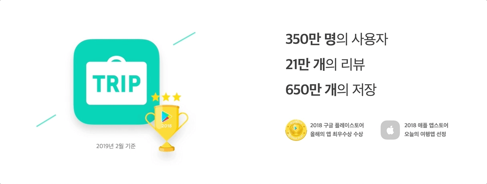
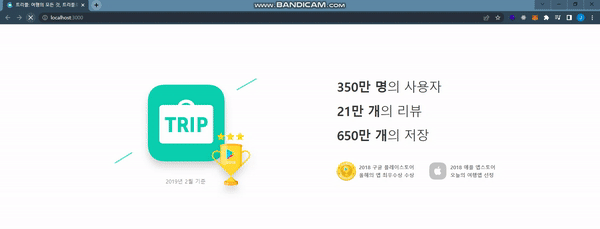

[TRIPLE_2022 공개채용] 과제 전형 / Frontend Homework #3

## 요구사항 & 산출물

> 요구사항
> 

> 산출물
> 

## 프로젝트 실행 방법

First, run the development server:

```bash
npm run dev
# or
yarn dev
```

Open [http://localhost:3000](http://localhost:3000) with your browser to see the result.

## 사용한 기술과 선택한 이유

- Next.js : Server-Side Rendering을 이용하는 SPA 서비스를 구현하기 위해서 선택했습니다.
- styled-components : 컴포넌트 기반으로 CSS를 작성하기 위해서 선택했습니다.
